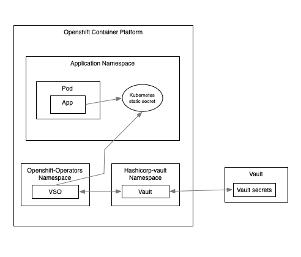

#Vault Secrets Operator (VSO) 

 

#Vault CLI config 

Ensure that you have the Vault CLI installed and that you connect to the Vault server. Set up the following environment variables.


```
$ export VAULT_ADDR="https://your-vault-address:8200"
$ export VAULT_TOKEN="the-token"
```

Check the connection is working using: `$ vault status` 
We need the JWT  token of the `ServiceAccount` that runs  the VSO controller deployment. 
The token will have a unique name so we need to query the `ServiceAccount` to find out what it is. In this instance it is: vault-secrets-operator-controller-manager-token-xdfzg

   
```
$ oc describe  sa vault-secrets-operator-controller-manager   -n openshift-operators  
Name:                vault-secrets-operator-controller-manager
Namespace:           openshift-operators
Labels:              operators.coreos.com/vault-secrets-operator.openshift-operators=
Annotations:         <none>
Image pull secrets:  vault-secrets-operator-controller-manager-dockercfg-lqzm9
Mountable secrets:   vault-secrets-operator-controller-manager-dockercfg-lqzm9
Tokens:              vault-secrets-operator-controller-manager-token-xdfzg
Events:              <none>
```
Store the token as an Environment variable.
  
```
$ export JWT_TOKEN=$(oc get secret vault-secrets-operator-controller-manager-token-xdfzg  -n openshift-operators -o jsonpath='{.data.token}' | base64 -d)

``` 

Enable the Hashicorp Vault kubernetes [authentication] engine. 

```
$ vault auth enable kubernetes
```
And create an AuthConfig in Vault using values from earlier. 
```
$ export KUBE_CA_CRT=$(oc get cm kube-root-ca.crt -n openshift-config -o jsonpath='{.data.ca\.crt}')   
$ export KUBE_HOST=$(oc config view --raw --minify --flatten --output 'jsonpath={.clusters[].cluster.server}')
$ vault write auth/kubernetes/config \                                                                 
     token_reviewer_jwt="$JWT_TOKEN" \
     kubernetes_host="$KUBE_HOST" \
     kubernetes_ca_cert="$KUBE_CA_CRT"

```
Confirm the settings: `$ vault read auth/kubernetes/config`

 Create the secrets 

(i) Enable the kv2 secrets engine. Use the Vault CLI
```
$ vault secrets enable -path=my-app  kv-v2

```
(ii) Write a  secret  to the vault. This will represent content for our app. (Vault CLI).
```
$ vault kv put my-app/examples-of-things  fruit="apple" animal="cat" name="fred" drink="beer" colour="red" clothing="hat" team="arsenal"  
```
(iii) Verify the secrets (Vault CLI). 
```
$ vault kv get my-app/examples-of-things 
```

  Create a Policy 
(i) Create a policy that defines access to the secret. (Vault CLI) 
```
$ vault policy write my-app-secrets - <<EOF
path "my-app/*" {
  capabilities = ["read" , "list"]
}
EOF
```

 Create a Role 
(i) A roles associates a kubernetes `ServiceAccount` and `Namespace` to a policy within Vault. (Vault CLI). 
```
$ vault write auth/kubernetes/role/my-app \
    bound_service_account_names=my-app-sa \
    bound_service_account_namespaces=my-app \
    policies=my-app-secrets \
    ttl=24h
```
The Hashicorp cloud Vault is now set up and ready to go. 


# Openshift config 
The Kubenetes API resources offered by the VSO now need to be configured. 

(i) VaultConnection - defines the endpoint for accessing the Vault server. Within a `Kustomize` context, this file can be located within the 'base' folder and share by all deployments of the app (see vault-connection.yaml). 

(ii) VaultAuth - Stores the credentials that will be used to access the VaultConnection (see vault-auth.yaml). This file will be unique to an environment and more likely to exist within an 'overlays' folder in `Kustomize`.  

(iii) VaultStaticSecret - Defines the SOURCE path within Vault holding the secret data. It also defines the DESTINATION of the `Secret` within OpenShift (see vault-static-secret.yaml).  The kubernetes `Secret` (the DESTINATION) will be managed directly from this `VaultStaticSecret` object. Any updates to deletions to the SOURCE in Vault will be reflected in the secret automatically.  This file will be unique to an environment and more likely to exist within an 'overlays' folder in `Kustomize`.  


 

